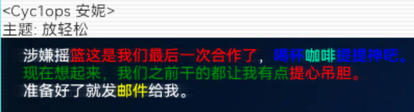

# HacknetChineseSupport
Hacknet模组中文支持


## 前置要求

您需要安装[Pathfinder](https://github.com/Arkhist/Hacknet-Pathfinder)后才可使用本模组


## 用法

将Example目录下的所有文件复制到plugins目录下即可


## 切换字体或调整字体大小

> **切换字体**

Example目录下存在Font目录，将您喜欢的字体放入该目录下即可加载（只能加载一个字体文件，您需要自行删除多余的字体文件）

> **修改字体大小**

Font目录下存在Config.ini文件是该字体的配置文件，可以修改字体大小，内容如下

```ini
[default]
;大字体；如Display面板中的连接到xxx字样
LargeFontSize=34
;小字体；如您是本系统管理员字样
SmallFontSize=20
;UI字体大小
UIFontSize=18
;左上角Ram模块，AppBar等字样字体大小
DetailFontSize=14
;修改设置字体大小时的增量改变
ChangeFontSizeInterval=2
;是否开启多色字体解析
OpenMultiColorFontParse=false
```


## 多色字体

在1.0.1版本中提供里多色字体用户使用，您可以使用以下效果达到彩色字体

```tex
涉嫌摇{color: Red}篮这是我们最后一次合作了{/}，{color: Blue}喝杯{color: 0 241 162}咖啡{/}提提神吧。{/}
{color: Green}现在想起来，我们之前干的都让我有点{color: Red}提心吊胆。{/}{/}
准备好了就发{color: Yellow}邮件{/}给我。
```

效果如下：



> **用法规则**

1. 首先您需要在配置文件中打开对多色字体的支持：OpenMultiColorFontParse=true
2. 您需要将需要渲染的文本包裹在{}{/}标记内部就像xml标签一样
3. 一对{}{/}标记不能跨多行，否则无效（`游戏原因具体看下面的注意事项`）
4. 目前标记内只支持`color`属性，属性值有两种写法
   - 直接写颜色名，需要存在该颜色且首字母大写，如：Red，Green等
   - 写agba或agba格式，重点用空格隔开**(不允许使用逗号等其他分隔符)**

5. 标记也可以写在所有定义文本内容的文件里如xml中的邮件定义或则是代码中

6. 标记可以嵌套使用，内层标记包裹的文本自动继承外侧文本的颜色，同时您也可以单独设置内层文本的颜色

**注意**：

hacknet部分地方会自动拆分文本为多行，比如邮件中您定义的文本为`{}准备好了就发给我。{/}`，游戏内可能会拆分为两行如下

`{}准备好了就发`

`给我。{/}`

此时会分两次渲染导致标记解析失败，您需要将上面的文本整改为如下部分才可以正常渲染

`{}准备好了就发{}`

`{}给我。{/}`


## 关于

若您使用了本模组请在模组说明处注明来源，这是我唯一的要求。
